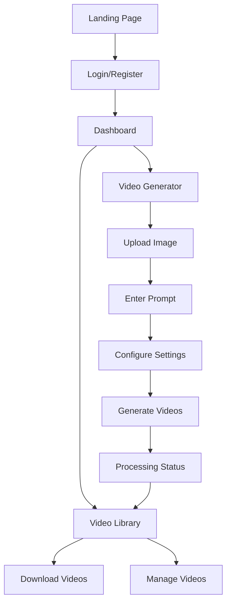

# SssS - UGC Automation Platform

## Product Requirements Document

## 1. Product Overview

SssS is an automated UGC (User-Generated Content) platform that enables users to create professional-style ad videos from product images using AI technology. Users upload product images with instruction prompts, configure video specifications, and receive automated UGC-style videos for marketing purposes.

The platform solves the challenge of creating engaging video content at scale for e-commerce businesses and marketers who need consistent, high-quality promotional videos without extensive video production resources.

## 2. Core Features

### 2.1 User Roles

| Role         | Registration Method  | Core Permissions                                                         |
| ------------ | -------------------- | ------------------------------------------------------------------------ |
| Free User    | Email registration   | Generate up to 10 videos per month, basic video configurations           |
| Premium User | Subscription upgrade | Unlimited video generation, advanced configurations, priority processing |

### 2.2 Feature Module

Our UGC automation platform consists of the following main pages:

1. **Authentication Pages**: User registration and login functionality
2. **Dashboard**: User statistics, quick actions, recent videos overview
3. **Video Generator**: Product image upload, prompt input, video configuration
4. **Video Library**: Generated videos management, download, and organization

### 2.3 Page Details

| Page Name       | Module Name         | Feature description                                                      |
| --------------- | ------------------- | ------------------------------------------------------------------------ |
| Login Page      | Authentication Form | Email/password login, error handling, redirect to dashboard              |
| Register Page   | Registration Form   | User signup with email verification, profile creation                    |
| Dashboard       | User Statistics     | Display total videos, monthly usage, generation limits                   |
| Dashboard       | Quick Actions       | Generate new video button, view library shortcut                         |
| Dashboard       | Recent Videos       | List of latest generated videos with status                              |
| Video Generator | Image Upload        | Drag-and-drop product image upload with validation (max 10MB)            |
| Video Generator | Prompt Input        | Text area for video generation instructions and style preferences        |
| Video Generator | Video Configuration | Select aspect ratio (16:9, 9:16, 1:1), duration (15-60s), quantity (1-5) |
| Video Generator | Generation Process  | Submit request, real-time progress tracking, status updates              |
| Video Library   | Video Grid          | Display all generated videos with thumbnails and metadata                |
| Video Library   | Search & Filter     | Search by prompt, filter by status, date, aspect ratio                   |
| Video Library   | Video Management    | Download videos, delete videos, view generation details                  |
| Navigation      | Header Menu         | Logo, navigation links, user profile, logout functionality               |

## 3. Core Process

**User Registration Flow:**
New users register with email and password, receive verification email, complete profile setup, and access the dashboard with free tier limitations.

**Video Generation Flow:**
Authenticated users navigate to video generator, upload product image, enter descriptive prompt, configure video specifications (aspect ratio, duration, quantity), submit generation request, monitor real-time progress, and receive notification when videos are ready.

**Video Management Flow:**
Users access video library, browse generated videos with search and filter options, preview videos, download completed videos, and manage their video collection.

## 4. User Interface Design

### 4.1 Design Style

* **Primary Colors**: #667eea (primary blue), #764ba2 (secondary purple)

* **Button Style**: Rounded corners with subtle shadows, gradient backgrounds for primary actions

* **Font**: Inter font family with weights 300-700, primary text 16px, headings 24-32px

* **Layout Style**: Card-based design with clean spacing, top navigation with sidebar for mobile

* **Icons**: Material Design icons with consistent sizing and color scheme

### 4.2 Page Design Overview

| Page Name       | Module Name         | UI Elements                                                                    |
| --------------- | ------------------- | ------------------------------------------------------------------------------ |
| Dashboard       | Statistics Cards    | White cards with colored accents, large numbers, progress bars for usage       |
| Dashboard       | Quick Actions       | Prominent gradient buttons, icon + text layout, hover animations               |
| Video Generator | Upload Zone         | Dashed border drag-and-drop area, file preview, upload progress indicator      |
| Video Generator | Configuration Panel | Segmented controls for aspect ratio, slider for duration, counter for quantity |
| Video Library   | Video Grid          | Responsive grid layout, thumbnail previews, status badges, hover overlays      |
| Video Library   | Filters             | Search bar with icon, dropdown filters, results counter                        |
| Navigation      | Header              | Gradient background, logo left-aligned, navigation center, user menu right     |

### 4.3 Responsiveness

The platform is designed mobile-first with responsive breakpoints at 768px and 1024px. Touch interactions are optimized for mobile devices with larger tap targets and swipe gestures. The layout adapts from single-column mobile to multi-column desktop views.

## 5. Technical Requirements

### 5.1 Performance Requirements

* Video generation processing time: 2-5 minutes per video

* Image upload maximum size: 10MB

* Supported image formats: JPG, PNG, WebP

* Video output formats: MP4 (H.264)

* Maximum concurrent generations per user: 3

### 5.2 Security Requirements

* Firebase Authentication for user management

* Secure file upload with virus scanning

* Rate limiting for API endpoints

* User data encryption in transit and at rest

* GDPR compliance for user data handling

### 5.3 Scalability Requirements

* Support for 1000+ concurrent users

* Auto-scaling Firebase Functions

* CDN delivery for generated videos

* Database optimization for large video libraries

* Queue management for video generation requests

## 6. Integration Requirements

### 6.1 External APIs

* AI video generation service (Runway ML, Stable Video, or custom)

* Payment processing (Stripe for premium subscriptions)

* Email service (Firebase Auth + SendGrid for notifications)

* Analytics tracking (Google Analytics)

### 6.2 Mobile App Readiness

* React-based architecture for React Native compatibility

* Shared business logic in contexts and utilities

* API-first design with Firebase backend

* Responsive design patterns adaptable to native components

* Offline capability considerations for video library

## 7. Success Metrics

### 7.1 User Engagement

* Monthly active users

* Video generation completion rate

* Average videos generated per user

* User retention rate (30-day, 90-day)

### 7.2 Technical Performance

* Video generation success rate (>95%)

* Average processing time (<5 minutes)

* Platform uptime (>99.5%)

* Page load times (<3 seconds)

### 7.3 Business Metrics

* Free to premium conversion rate

* Monthly recurring revenue

* Customer acquisition cost

* Customer lifetime value

