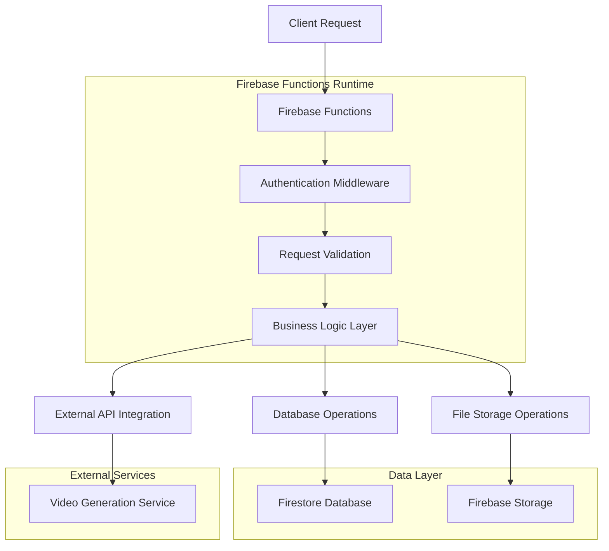

# SssS - UGC Automation Platform

## Technical Architecture Document

## 1. Architecture Design


## 2. Technology Description

* **Frontend**: React\@18 + Material-UI\@5 + React Router\@6 + Vite

* **Backend**: Firebase (Authentication, Firestore, Storage, Functions)

* **Database**: Firestore (NoSQL)

* **File Storage**: Firebase Storage

* **Serverless Functions**: Firebase Cloud Functions (Node.js 18)

* **Hosting**: Firebase Hosting

* **External APIs**: Video generation services, Email notifications

## 3. Route Definitions

| Route      | Purpose                                          |
| ---------- | ------------------------------------------------ |
| /          | Landing page with authentication redirect        |
| /login     | User login page                                  |
| /register  | User registration page                           |
| /dashboard | Main dashboard with user stats and quick actions |
| /generate  | Video generation interface                       |
| /library   | Video library and management                     |
| /profile   | User profile and settings                        |

## 4. API Definitions

### 4.1 Core API

**Video Generation**

```
POST /generateVideo (Firebase Function)
```

Request:

| Param Name      | Param Type | isRequired | Description                                    |
| --------------- | ---------- | ---------- | ---------------------------------------------- |
| productImageUrl | string     | true       | Firebase Storage URL of uploaded product image |
| prompt          | string     | true       | User instruction for video generation          |
| aspectRatio     | string     | true       | Video aspect ratio (16:9, 9:16, 1:1)           |
| duration        | number     | true       | Video duration in seconds (15-60)              |
| videoCount      | number     | true       | Number of videos to generate (1-5)             |
| style           | string     | false      | Video style preference (ugc, professional)     |

Response:

| Param Name | Param Type | Description                |
| ---------- | ---------- | -------------------------- |
| success    | boolean    | Operation success status   |
| requestIds | array      | Array of video request IDs |
| message    | string     | Success/error message      |

Example:

```json
{
  "productImageUrl": "gs://bucket/images/product123.jpg",
  "prompt": "Create an engaging UGC-style video showcasing this product's benefits",
  "aspectRatio": "9:16",
  "duration": 30,
  "videoCount": 2,
  "style": "ugc"
}
```

**User Statistics**

```
POST /getUserStats (Firebase Function)
```

Response:

| Param Name        | Param Type | Description                        |
| ----------------- | ---------- | ---------------------------------- |
| totalVideos       | number     | Total videos generated by user     |
| completedVideos   | number     | Successfully completed videos      |
| pendingVideos     | number     | Videos in processing queue         |
| failedVideos      | number     | Failed video generations           |
| currentMonthUsage | number     | Videos generated this month        |
| monthlyLimit      | number     | User's monthly generation limit    |
| remainingVideos   | number     | Remaining videos for current month |

### 4.2 Authentication API

Authentication is handled by Firebase Auth SDK with the following methods:

* `signInWithEmailAndPassword(email, password)`

* `createUserWithEmailAndPassword(email, password)`

* `signOut()`

* `onAuthStateChanged(callback)`

### 4.3 Database Operations

Firestore collections and operations:

**Users Collection**

* `users/{userId}` - User profile and settings

* `users/{userId}/monthlyUsage` - Monthly usage tracking

**Video Requests Collection**

* `videoRequests/{requestId}` - Video generation requests

* Real-time listeners for status updates

**Generated Videos Collection**

* `generatedVideos/{videoId}` - Completed video metadata

* Query by userId, status, createdAt

## 5. Server Architecture Diagram



## 6. Data Model

### 6.1 Data Model Definition


### 6.2 Data Definition Language

**Users Collection Structure**

```javascript
// users/{userId}
{
  id: "user123",
  email: "user@example.com",
  displayName: "John Doe",
  plan: {
    type: "free", // free, premium
    monthlyLimit: 10,
    features: ["basic_generation"]
  },
  monthlyUsage: {
    "2024-01": 5,
    "2024-02": 8
  },
  createdAt: Timestamp,
  updatedAt: Timestamp
}
```

**Video Requests Collection Structure**

```javascript
// videoRequests/{requestId}
{
  id: "req123",
  userId: "user123",
  productImageUrl: "gs://bucket/images/product.jpg",
  prompt: "Create engaging UGC video",
  aspectRatio: "9:16",
  duration: 30,
  style: "ugc",
  status: "pending", // pending, processing, completed, failed
  createdAt: Timestamp,
  updatedAt: Timestamp
}
```

**Generated Videos Collection Structure**

```javascript
// generatedVideos/{videoId}
{
  id: "video123",
  userId: "user123",
  requestId: "req123",
  title: "Product UGC Video",
  prompt: "Create engaging UGC video",
  aspectRatio: "9:16",
  duration: 30,
  style: "ugc",
  status: "completed", // pending, processing, completed, failed
  progress: 100, // 0-100
  videoUrl: "gs://bucket/videos/video123.mp4",
  thumbnailUrl: "gs://bucket/thumbnails/video123.jpg",
  fileSize: 5242880, // bytes
  productImageUrl: "gs://bucket/images/product.jpg",
  createdAt: Timestamp,
  completedAt: Timestamp,
  updatedAt: Timestamp
}
```

**Firestore Security Rules**

```javascript
// Allow users to read/write their own data
rules_version = '2';
service cloud.firestore {
  match /databases/{database}/documents {
    // Users can read/write their own user document
    match /users/{userId} {
      allow read, write: if request.auth != null && request.auth.uid == userId;
    }
    
    // Users can read/write their own video requests
    match /videoRequests/{requestId} {
      allow read, write: if request.auth != null && request.auth.uid == resource.data.userId;
    }
    
    // Users can read/write their own generated videos
    match /generatedVideos/{videoId} {
      allow read, write: if request.auth != null && request.auth.uid == resource.data.userId;
    }
  }
}
```

**Firestore Indexes**

```json
{
  "indexes": [
    {
      "collectionGroup": "videoRequests",
      "queryScope": "COLLECTION",
      "fields": [
        {"fieldPath": "userId", "order": "ASCENDING"},
        {"fieldPath": "createdAt", "order": "DESCENDING"}
      ]
    },
    {
      "collectionGroup": "generatedVideos",
      "queryScope": "COLLECTION",
      "fields": [
        {"fieldPath": "userId", "order": "ASCENDING"},
        {"fieldPath": "status", "order": "ASCENDING"},
        {"fieldPath": "createdAt", "order": "DESCENDING"}
      ]
    }
  ]
}
```

## 7. Mobile App Compatibility

### 7.1 React Native Readiness

The current React web application is structured for easy React Native migration:

**Shared Components Strategy:**

* Business logic separated in contexts (`AuthContext`)

* Firebase SDK compatibility with React Native

* Component-based architecture with props interface

* Utility functions for data processing

**Platform-Specific Considerations:**

* Image picker integration for mobile cameras

* Push notifications for video completion

* Offline video library caching

* Native video player integration

* File system access for downloads

**Migration Path:**

1. Create React Native project structure
2. Install React Native Firebase SDK
3. Migrate shared contexts and utilities
4. Recreate UI components with React Native elements
5. Implement platform-specific features
6. Test cross-platform functionality

### 7.2 Code Sharing Strategy

```
shared/
├── contexts/
│   ├── AuthContext.js
│   └── VideoContext.js
├── utils/
│   ├── firebase.js
│   ├── validation.js
│   └── helpers.js
├── constants/
│   ├── config.js
│   └── enums.js
web/
├── components/
├── pages/
└── styles/
mobile/
├── components/
├── screens/
└── styles/
```

## 8. Deployment and DevOps

### 8.1 Environment Configuration

**Development Environment:**

* Firebase Emulator Suite for local development

* Hot reload for React development

* Local Firebase Functions testing

**Production Environment:**

* Firebase Hosting for web application

* Firebase Functions for serverless backend

* Firebase Storage for file hosting

* CDN integration for global content delivery

### 8.2 CI/CD Pipeline

```yaml
# GitHub Actions workflow
name: Deploy to Firebase
on:
  push:
    branches: [main]
jobs:
  deploy:
    runs-on: ubuntu-latest
    steps:
      - uses: actions/checkout@v2
      - name: Setup Node.js
        uses: actions/setup-node@v2
        with:
          node-version: '18'
      - name: Install dependencies
        run: npm install
      - name: Build application
        run: npm run build
      - name: Deploy to Firebase
        uses: FirebaseExtended/action-hosting-deploy@v0
        with:
          repoToken: '${{ secrets.GITHUB_TOKEN }}'
          firebaseServiceAccount: '${{ secrets.FIREBASE_SERVICE_ACCOUNT }}'
          projectId: 'ssss-ugc-platform'
```

### 8.3 Monitoring and Analytics

* Firebase Performance Monitoring

* Google Analytics for user behavior

* Firebase Crashlytics for error tracking

* Custom metrics for video generation success rates

* Cost monitoring for Firebase usage

## 9. Security Considerations

### 9.1 Authentication Security

* Firebase Auth with email verification

* Password strength requirements

* Rate limiting for authentication attempts

* Session management and token refresh

### 9.2 Data Security

* Firestore security rules for data access control

* Firebase Storage rules for file access

* Input validation and sanitization

* HTTPS enforcement for all communications

### 9.3 API Security

* Firebase Functions authentication middleware

* Request rate limiting

* Input validation for all endpoints

* Error handling without information disclosure

## 10. Performance Optimization

### 10.1 Frontend Optimization

* Code splitting with React.lazy()

* Image optimization and lazy loading

* Caching strategies for static assets

* Bundle size optimization

### 10.2 Backend Optimization

* Firebase Functions cold start optimization

* Database query optimization

* File upload optimization with resumable uploads

* CDN integration for global content delivery

### 10.3 Scalability Planning

* Auto-scaling Firebase Functions

* Database sharding strategies

* Queue management for video processing

* Load balancing considerations

